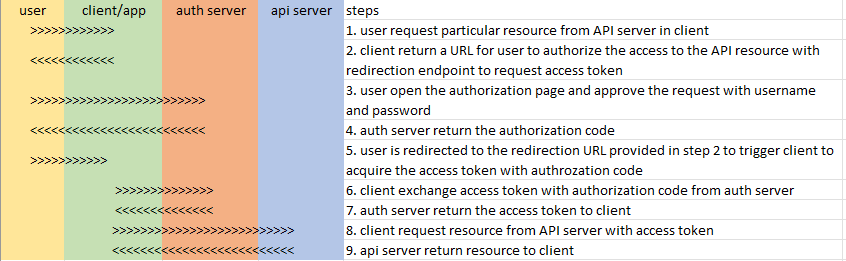

# Authorization Service
This project is a prototype of authorization service used to guard specific API resource behind. It launches servers
* [client](client_server/)
* [authorization](auth_server/)
* [API resource](api_server/)

to simulate the server side application oauth2 authorization flow. More reference can be found [here](https://www.oauth.com/oauth2-servers/server-side-apps/)

## Flow to retrieve 

note: username and password are both "admin" for authorization

## Prepare Environment
Ensure python3.9 or above is available in your environment
```
# create virtual environment
python -m venv venv

# activate the environment
source venv/bin/activate

# install required dependencies
pip install -r requirements.txt
```

## Launch Servers in Dev Environment
Follow the commands below to launch the servers in separate terminals
* launch client
    ```
    cd {project_root}/client_server
    uvicorn client_server:app --reload --port 8000
    ```

* launch authentication/authorization server
    ```
    cd {project_root}/auth_server
    uvicorn auth_server:app --reload --port 8001
    ```

* launch api server
    ```
    cd {project_root}/api_server
    uvicorn api_server:app --reload --port 8002
    ```

## Work to complete this prototype
Since this is a prototype, there are several points below need to be completed if this authorization service is put into real use. **Currently neither authorization code or access code has expiration time**.  
- Include expiration time in encoding to produce authorization code, and disable authorization code when it expires.
- Apply safer encryption to generate authorization code
- Implement access code management by specific scheme. This scheme should specify how to
    - generate the access code
    - share the access code between auth_server and api_server
    - disable it when it expire
- (Optional) Create mapping among user, client and api resource
